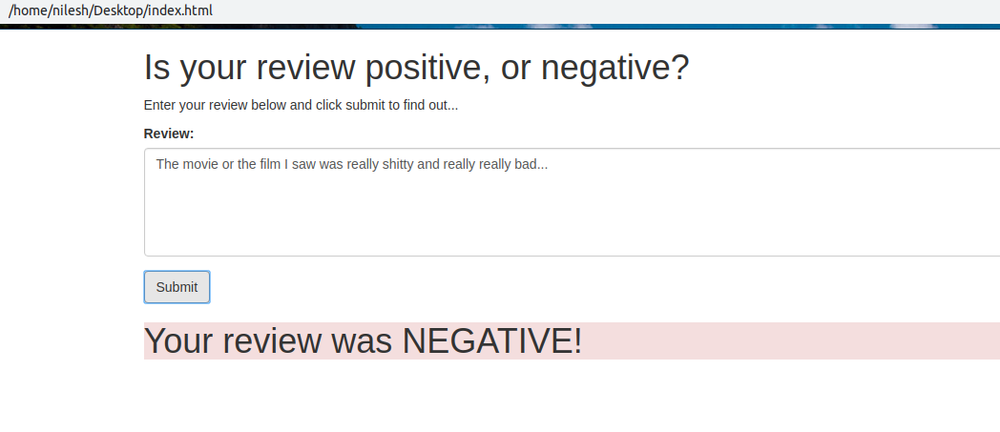
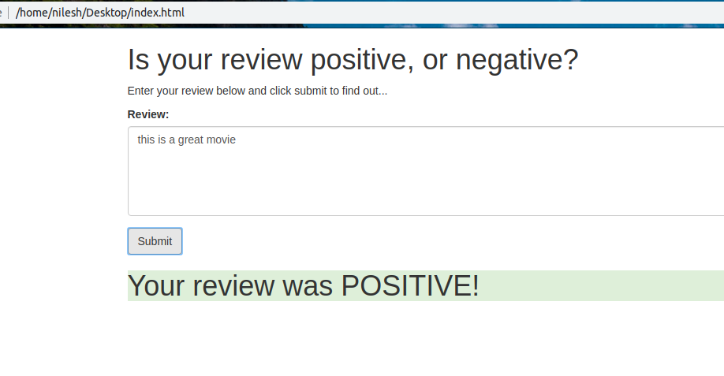

# SageMaker Deployment Project

I have trained a LSTM model for sentiment analysis of IMDB reviews. All the data preprocessing, modeling and deployment is done using AWS SageMaker. Created a web app that is connected to the deployed models endpoint using AWS REST APT and AWS Lambda.  

